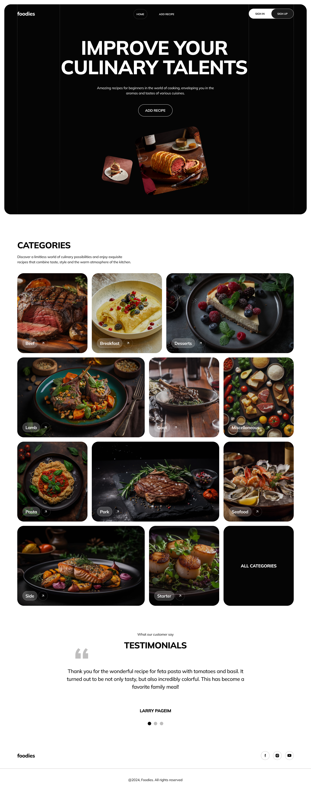
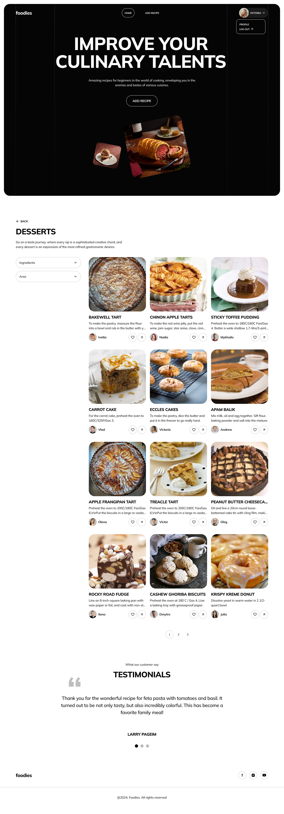
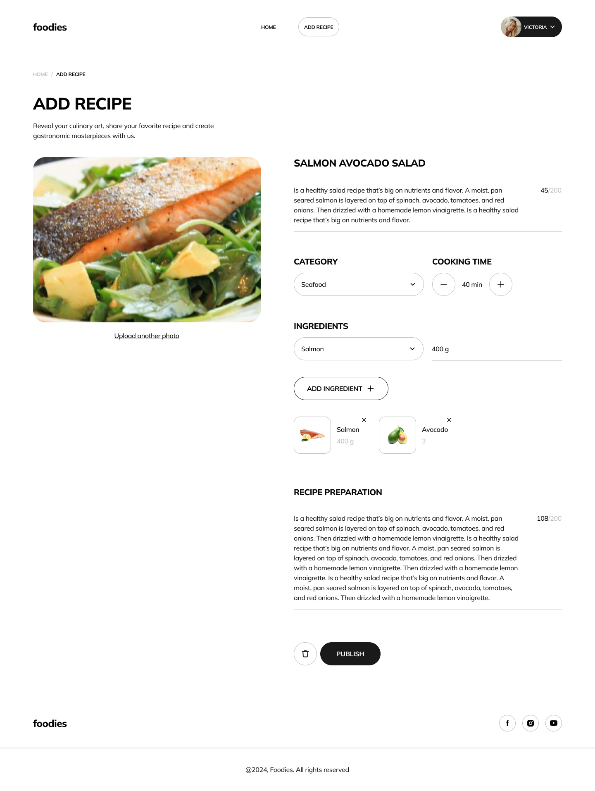
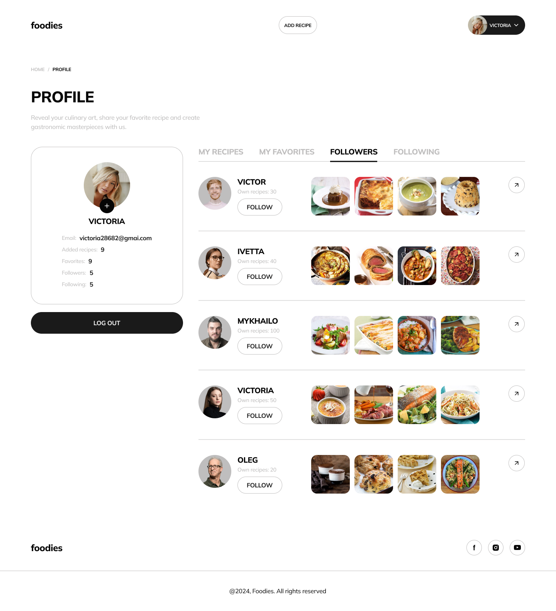
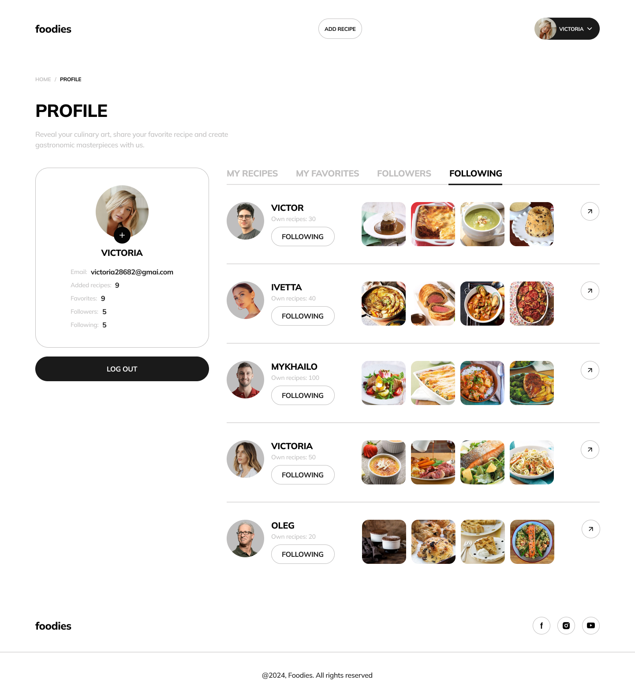

 
  

&#xa0;

<h1 align="center">Foodies App</h1>

## Description:

[Foodies App](https://partizanen69.github.io/team-project-foodies-frontend/) is
a website for creating and managing recipes. Website fully responsive design,
oriented to any device (mobile, tablet, desktop).

  
  

### Features:

- Registration and Login: user have the option to register and login (used:
  name, email, password)
- User have the option to choose/change his profile
- Create/delete your own recipe. View your own recipe collection and other
  users' recipe collections

  

    
    
  

- Browse recipes by category, and filter recipes by arreas, category, and
  ingredient.
- View testimonials
- Add/remove recipes from favorites
- Follow the profiles of other users and view the followers of your own profile

  
  

## Technologies Used:

### FrontEnd:

- **HTML/CSS**
- **JavaScript**
- **Axios**
- **React**
- **React-router-dom**
- **ReduxToolkit**
- **React-hook-form**
- **React-icons**
- **React-loader-spinner**
- **SASS**
- **Yup**
- **Swiper**
- **Web-vitals**

### BackEnd

- **Node.js**
- **Express**
- **Mongoose**
- **Swagger**
- **Bcrypt**
- **Dotenv**
- **Cloudinary**
- **Cors**
- **Jimp**
- **Joi**
- **Jsonwebtoken**
- **Morgan**
- **Multer**
- **Gravatar**
- **Nanoid**
- **Yamljs**

### Swagger documentation:

Swagger UI for documenting and visualizing the API using
[Swagger documentation](http://localhost:3000/api/docs/).

### Backend repository:

[foodies-backend](https://github.com/partizanen69/team-project-foodies-backend).

## Developers

The development of this project was led by:

- [Oleksii Ablitsov](https://github.com/partizanen69)- Team lead & Fullstack
  developer
- [Maryna Korbet](https://github.com/Maryna-Korbet)- Scrum master & Fullstack
  developer
- [Oleksii Ostafiichuk](https://github.com/OstafiichukO) - Fullstack developer
- [Nataliia Smalchenko](https://github.com/nataliia-smalchenko) - Fullstack
  developer
- [Mykola Ovchynnik](https://github.com/mykola-ovchynnik) - Fullstack developer
- [Anton Kashnykov](https://github.com/KashnykovAnton) - Fullstack developer
- [Serhii Tarasenko](https://github.com/stdev33?tab=repositories) - Fullstack
  developer
- [Irina Bazhinova](https://github.com/Iris2030) - Fullstack developer
- [Olena Panchenko](https://github.com/marychka2335) - Fullstack developer
